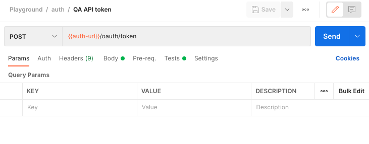
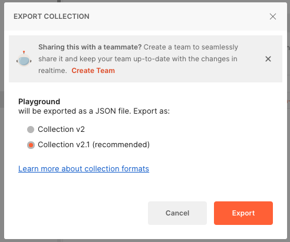
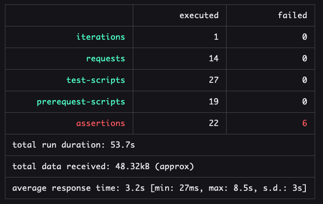

# Run Postman request in parallel to shorten the runtime of the tests

A known limitation of the Postman Collection Runner is that it can only execute collection in a consecutive way.
The scope is to offer a simple way to run the tests faster in paralel, thus shortening the runtime.

## Create your Postman Collection and corresponding tests

Here I needed to call the AuthService api `/oauth/token` to get the token. 

 

## Export your collection and the environment variables



And save the files in a `playground/` directory or anywhere else. You need to specify the path when you run the script.

## Create the new npm project

Simply run `yarn`
Modify the script to you needs.

## The script !

Run the script with the follwoing parameters

```
NEWMAN_THREADS=8 NEWMAN_COLLECTION=playground/your_collection.json NEWMAN_ENV_FILE=playground/your_environment.json yarn start
```

